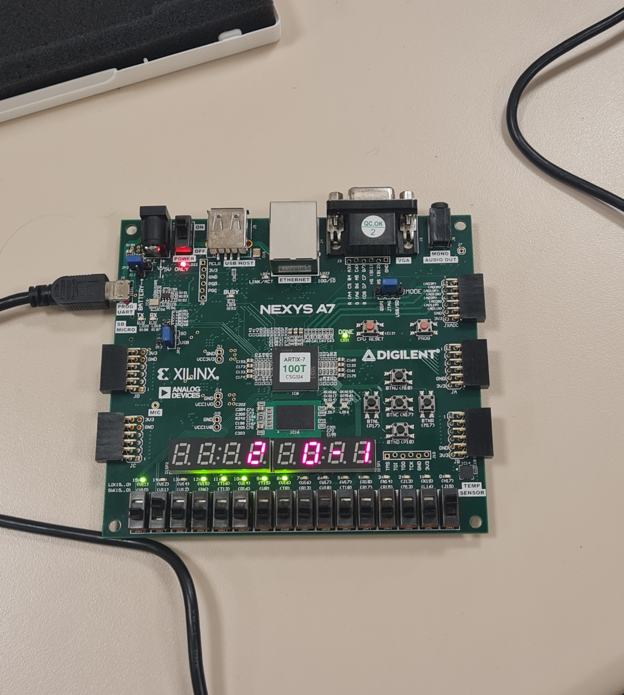

# FPGA Air-Hockey — Digital Showdown

A two-player air-hockey game implemented **entirely in Verilog** and deployed on the **Digilent Nexys A7** FPGA board. A 5 × 5 LED matrix animates the puck, while dual seven-segment displays keep score and show live coordinates. Built for Sabancı University’s “Logic & Digital System Design” course (Fall 2023-24), the project walks through all classic stages of an FPGA design—state-diagram modelling, simulation, synthesis, timing closure, and on-board bring-up—yet remains an addictive dorm-room time-killer.

<p align="center">
  
  <br><em>Nexys A7 running FPGA-AirHockey (puck mid-flight)</em>
</p>

---

## 🚀 Quick Start

```bash
# 1 – Clone
git clone https://github.com/yunusdanabas/FPGA-AirHockey.git
cd FPGA-AirHockey

# 2 – Open in Vivado (2023.1+ recommended)
vivado FPGA-AirHockey.xpr &

# 3 – Generate bitstream
#    (Flow Navigator ▶ Program & Debug ▶ Generate Bitstream)

# 4 – Program the Nexys A7
open_hw_manager        # or use the Vivado GUI
program_hw_devices
```

---

## 🏒 Gameplay Overview

* **Two Players:** BTNL (Player A) and BTNR (Player B) act as paddles.
* **Digital Rink:** A 5 × 5 LED grid visualises puck motion.
* **Real-Time HUD:** Dual seven-segment displays show `[X,Y]` and running score.
* **Win Condition:** First to the user-selected goal limit (default = 3) wins; LEDs flash in victory pattern.

---

## ✨ Features

| Category            | Highlights                                                               |
| ------------------- | ------------------------------------------------------------------------ |
| **Interactivity**   | Adjustable puck speed (0.5 s / 1 s), goal limit via slide switches       |
| **Robust Design**   | Debounced inputs, metronome-style clock divider, one-hot FSM             |
| **Visual Feedback** | Smooth LED “ping-pong” animation; score flashes on goal                  |
| **Verification**    | Self-checking Verilog testbench (`hockey_tb.v`) for full match scenarios |
| **Modularity**      | Re-usable `clk_divider`, `debouncer`, `ssd_driver` sub-modules           |

The section ordering and compact feature table follow the template used in my other robotics README files .

---

## ⚙️ How It Works

1. **Initialization**
   System resets to `IDLE`, scores `[0 : 0]`, puck centred.

2. **Serve**
   Player A presses **BTNL** → FSM enters `SEND_A`, LED column marches towards Player B.

3. **Return / Miss**

   * **Return:** Player B times **BTNR** at correct coordinate → FSM reverses direction (`SEND_B`).
   * **Miss:** Timer expiry or wrong coordinate → Player A scores, score display blinks.

4. **Victory**
   Once `score_A` or `score_B` == `GOAL_LIMIT`, FSM transitions to `END_GAME`, LEDs alternate flash pattern.

The full state diagram lives in *Phase1.pdf* and is reproduced in simplified form below:

```text
IDLE -> {SERVE_A | SERVE_B}
SERVE_A -> SEND_A -> {RESP_B | GOAL_A}
RESP_B -> {SERVE_B | GOAL_A}
...
GOAL_A/B -> {IDLE | END_GAME}
```

---

## 📂 Project Structure

```
FPGA-AirHockey/
├── src/
│   ├── core/
│   │   ├── hockey_fsm.v        # main state machine
│   │   ├── clk_divider.v       # parameterisable clock scaler
│   │   ├── debouncer.v         # single-pulse button cleaner
│   │   └── ssd_driver.v        # seven-segment multiplexing
│   └── top/
│       └── top_airhockey.v     # pinout + core integration
├── tb/
│   └── hockey_tb.v             # self-checking testbench
├── constr/
│   └── nexys_a7.xdc            # pin constraints
├── docs/
│   └── Phase1.pdf              # design diagrams & FSM
└── assets/
    ├── img/                    # board photo, block diagrams
    └── video/Gameplay.mp4      # demo clip
```

---

## 🛠 Build & Run

| Stage          | Command / Action                                           |
| -------------- | ---------------------------------------------------------- |
| **Simulate**   | `vivado -mode tcl -source run_tb.tcl` (runs `hockey_tb.v`) |
| **Synthesise** | Flow Navigator ▶ “Run Synthesis”                           |
| **Implement**  | Flow Navigator ▶ “Run Implementation”                      |
| **Bitstream**  | Flow Navigator ▶ “Generate Bitstream”                      |
| **Program**    | Connect Nexys A7 via USB-JTAG; click “Program Device…”     |

---

## 🔧 Customization

| Parameter        | Location                | Description                    |
| ---------------- | ----------------------- | ------------------------------ |
| `PUCK_SPEED_SEL` | `top_airhockey.v`       | 0 = 1 s/step, 1 = 0.5 s/step   |
| `GOAL_LIMIT`     | Slide switches SW\[2:0] | Goals to win (1-7)             |
| `CLK_DIV`        | `clk_divider.v` generic | Output tick period (in cycles) |

---

## 🎞 Demo Video

<p align="center">
  <video src="assets/video/Gameplay.mp4" controls loop muted width="85%"></video>
</p>

---

## 📜 License & Credits

* **License:** MIT
* **Course:** Logic & Digital System Design (Sabancı University, Fall 2023-24)
* Special thanks to **Atıl Utku Ay** for project supervision and feedback.

Enjoy the game, fork away, and may your debounce always be clean!
